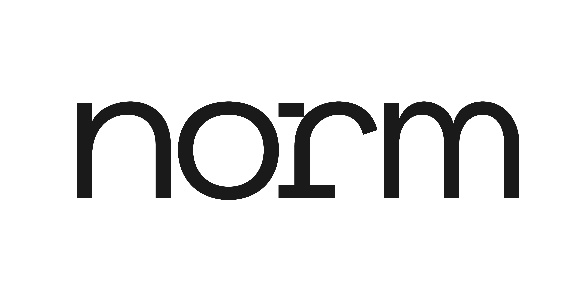

<h1 align="center">Norm</h1>

  📁 <a href="https://github.com/jhuashao/norm-sans/releases"><strong>Download latest release of Norm Sans</strong></a>

Norm is a contemporary sans-serif type family that blends monospace functionality with modernist geometric accents. The spirit of this typeface is an attempt to create a bridge between computational and humanist traditions — balancing and blending features from monospace and neo-grotesques type cultures.

## Features

### Design Details

Norm Sans is available in **7 weights** and **14 styles**, ready to use right out of the box. It works particularly well in display sizes, but can hold its own when set in body text.

### Open Source

Modification, re-distribution, and commercial usage is made possible under the [SIL Open Font License, Version 1.1](/LICENSE).

## Downloading
You can always find the [latest release of Norm Sans available for download](https://github.com/jhuashao/norm-sans/releases) in this repository’s [Releases](https://github.com/jhuashao/norm-sans/releases) tab.

## Modifying & Distributing

Norm Sans is an open source project and is free to modify, alter, and distribute. Please see the [SIL Open Font License, Version 1.1](https://opensource.org/licenses/OFL-1.1) for further details and specifications.

Start modifying this typeface to your own personalized liking by [forking it](https://github.com/jhuashao/norm-sans/fork). You may then make any edits you’d like, and customize it endlessly.

## Contributing

Thank you for considering contributing to Norm Sans. Active contributions from the community help drive open source projects like this forward. If you are new to contributing to open source projects, check out GitHub’s own [great beginning guide](https://opensource.guide/how-to-contribute/) to getting started.

To begin the contribution process, start by [forking](https://github.com/jhuashao/norm-sans/fork) this repository and make your planned additions to Norm Sans. Then you can [create a pull request](https://github.com/jhuashao/norm-sans/compare) which will be reviewed and iterated upon. If the proposed changes look good, your pull request will be merged and readily available for use.

If you require any more assistance, please don’t hesitate to open up an [issue](https://github.com/jhuashao/norm-typeface/issues) in this repository or send a direct message to the repository’s owner [@jhuashao](https://github.com/jhuashao).
