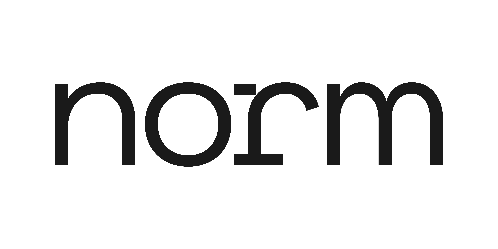

# Norm

Norm is a contemporary sans-serif type family that blends monospace aesthetics with modernist geometric accents. The spirit of this typeface is an attempt to create a bridge between computational and humanist traditions.

Norm was created as a balancing act between monospace and neo-grotesque typefaces, and blends design features from both type cultures.

Current font styles for Norm Sans:

| Name                 | Weight class
| -------------------- | ----------------
| Thin                 | 100
| Extra-Light          | 200
| Light                | 300
| Regular              | 400
| Medium               | 500
| Semi Bold            | 600
| Bold                 | 700

## [⬇︎ Download the latest release]()

After downloading the zip from above:

1. Double-click the downloaded zip file to unpack or open it.
2. Follow the instructions in "install-mac.txt" or "install-win.txt", depending
   on what operating system you're using.
   
## See also

- [Contributing](CONTRIBUTING.md)
- [Compiling font files](CONTRIBUTING.md#compiling-font-files)
- [SIL Open Font License](LICENSE.txt)   
   
### Tools
- [Glyphs](https://glyphsapp.com/)
- [Labelkey](https://github.com/RobertPratley/labelKey) (Glyphs plugin)
- [DINAMO Font Gauntlet](https://dinamodarkroom.com/) for testing   
  
### Share In Use!
If you use any of these fonts out in the world I want to know! Please get in touch via email (joshua.h.shao@gmail.com) or on [Instagram](https://instagram.com/jhuashao) or [Twitter](https://twitter.com/jhuashao).
