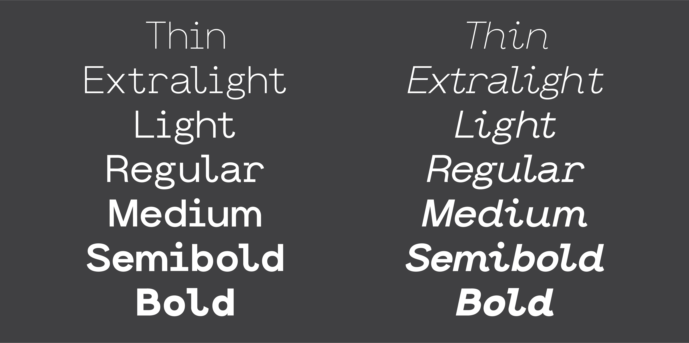

# Norm

Norm is a contemporary sans-serif type family that blends monospace functionality with modernist geometric accents. The spirit of this typeface is an attempt to create a bridge between computational and humanist traditions.

Norm was created as a balancing act between monospace and neo-grotesque typefaces, and blends design features from both type cultures.

## Features

### Design Details

7 Weights/ 14 Styles

### Open Source

Norm Sans is ready to use right out of the box and works particularly well in display sizes, but can hold its own when set in body text. Modification, re-distribution, and commercial usage is made possible under the [SIL Open Font License, Version 1.1](https://opensource.org/licenses/OFL-1.1).

## Download Norm Sans

### Font Files

### [⬇︎ Download the latest release](https://github.com/jhuashao/norm-sans/releases)

Individual Font File Formats([?](https://creativemarket.com/blog/the-missing-guide-to-font-formats)):

Download only the TrueType(TTF) files of Norm Sans

Download only the OpenType(OTF) files of Norm Sans

Download only the Web Open Font Format(WOFF) files of Norm Sans

### Source Files `.glyphs`

Download only Norm Sans source files `.glyphs`

Download only Norm Sans Italic source files `.glyphs`

## Contributing

Thank you for considering contributing to Norm Sans, as an open-source typeface, it's from active contributions from the community that help drive projects like this forward. For further documentation on contributing to Norm Sans, please see CONTRIBUTING.md.

If you are new to contributing to open-source projects, a great beginning guide to getting started is GitHub's own [Open Source Guide](https://opensource.guide/how-to-contribute/). 

If you are new to type design and it's practices, please refer below to **Type Design Resources** located at the bottom of this README. 

If you require any more assistance at all, please don't hesitate to open up and [ISSUE](https://github.com/jhuashao/norm-typeface/issues) in this repository, or send a direct message to the repository's owner @Joshua Shao

## Modifying & Distributing

As mentioned before in this README, Norm Sans is an open-source project and is free to modify, alter, and distribute. Please see the SIL Open Font License for further details and specifications.

In order to start modifying Norm Sans for your personal interests 

## Commercial Usage

## More Information

## Type Design Resources

## Open Source Resources
